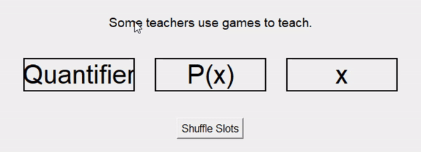

# Discrete Structures Slot Machine Game

This is a fun and interactive slot machine game designed to help students learn about quantifiers and logical statements in Discrete Structures. The game uses randomization and animation to shuffle quantifiers, variables, and predicates, allowing students to identify and analyze various logical components.

## Installation

1. **Clone the repository:**
```bash
git clone https://github.com/markpenales/discrete-math-slot-machine
cd discrete-math-slot-machine
```

2. Install Dependencies
```bash
pip install -r requirements.txt
```

## Project Features

- **Slot Machine Animation**: The three slots spin and shuffle randomly, showing quantifiers (`∀`, `∃`), a predicate (`P(x)`), and a variable (`x`).
- **Random Statement Display**: After the spin, a random logical statement is displayed. Each display will correspond to a student, that student will identify the part of the statement that his slot pertains to.
- **Full-Screen Mode**: You can press **F11** to enter full-screen mode and **Escape** to exit it.

## Game
